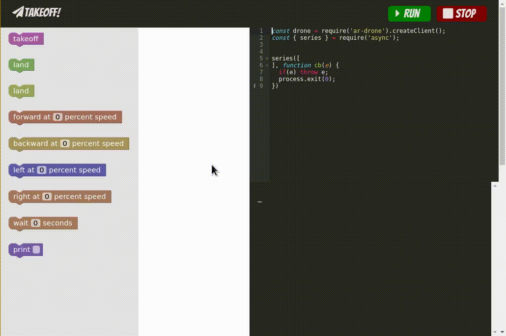

# Takeoff!

Takeoff is a visual programming environment for drones!



# Usage

This project is in a super early stage, there will be a lot of hands on work to
get going. In the future we plan on making this better.

```
$ git clone git@github.com:retrohacker/takeoff
$ cd takeoff
$ npm install
$ npm start
```

And you are off!
